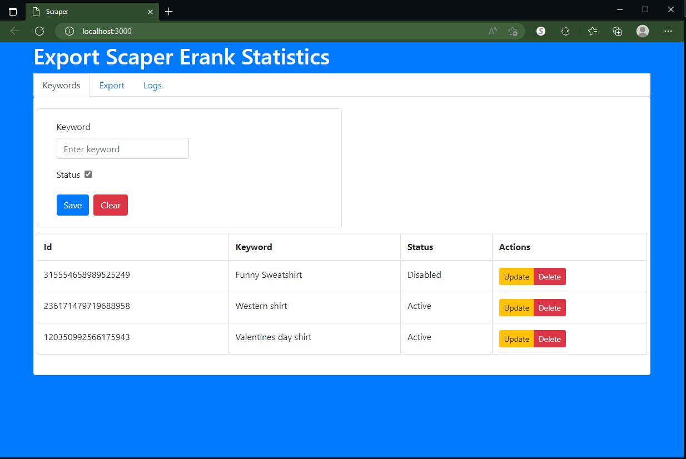
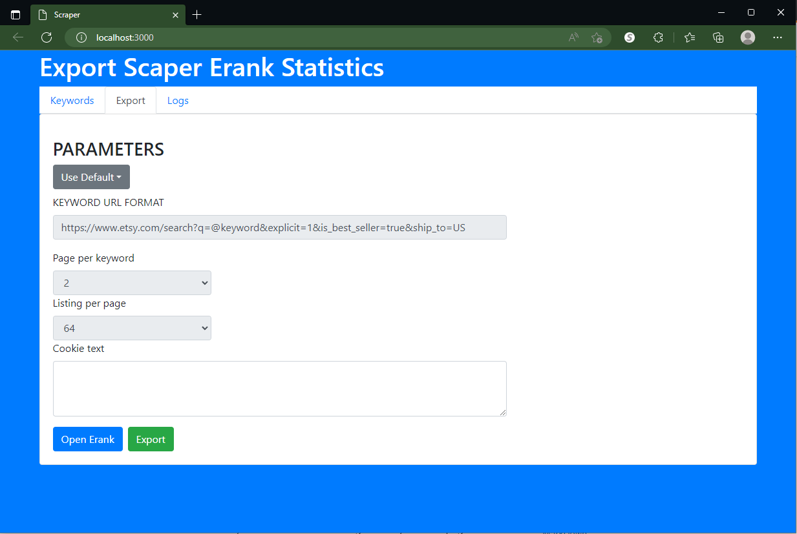

# Instructions Manually

## Installers.
* install python 3.9 or higher.
* install pip.
* install node v12 higher.

* Open the Terminal in windows:
    * type and open: `command prompt`.
    * then follow all the steps, for the backend and frontend.

## Intallation at Folder backend.
* Create virtual environment.
    * Copy and paste: `python -m venv venv`
    * Enter in the terminal: `venv\Scripts\activate`
    * Install the requirements: `pip install -r requirements.txt`

## Add the extension to chrome.
* Open chrome.
* Go to the url: `chrome://extensions/`
* Activate the developer mode.
* Load unpacked extension and select the folder: `erank-cookie-shower`

## Run at Folder backend in the command prompt.
* Run the project: `flask run`

## Insatallation Folder client.
* Install the requirements: `npm install`

## Run Folder client in the command prompt.
* Run the project: `npm run dev`
* Go to the browser: `http://localhost:3000/`

# Screen Form Keyword

# Screen Form Export

# Screen Logs

 
Check the logs if any issues
